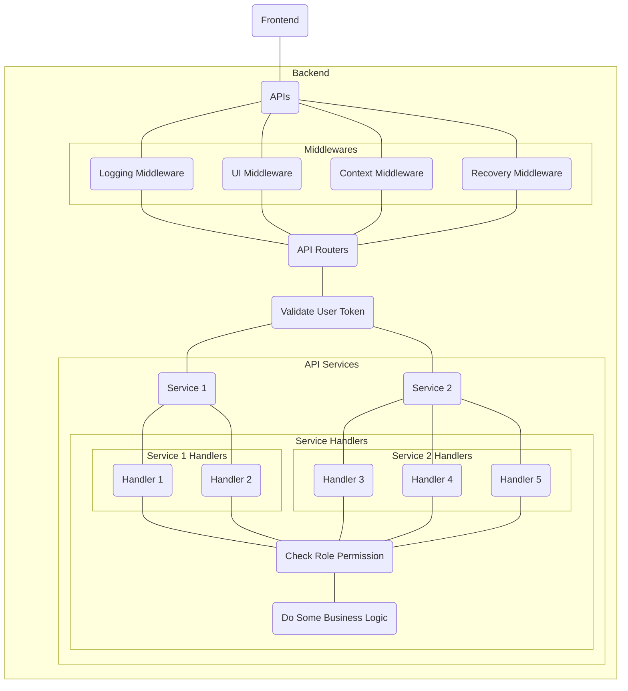

# MUI

MES User Interface services.

## Prerequisite

- Installations
  - Go 1.15 or higher
    - [Install Go](https://golang.org/doc/install#install)
  - Swagger v0.27.0
    - [Install swagger generator](https://github.com/go-swagger/go-swagger/releases/tag/v0.27.0)
  - VueJS
    - [Install node.js(v14.17.3)](https://nodejs.org/en/blog/release/v14.17.3/)
    - [Install yarn(v1.22.11) for Windows](https://classic.yarnpkg.com/en/docs/install/#windows-stable) or [install nvm(v6.14.13) for Windows](https://github.com/coreybutler/nvm-windows/releases)
    - [Install vuejs](https://vuejs.org/v2/guide/installation.html)
    - [Install element-ui](https://element.eleme.io/#/en-US/component/installation)
    - [Install ESLint](https://marketplace.visualstudio.com/items?itemName=dbaeumer.vscode-eslint)
  - [Protoc Gen Typescript v0.8.5](https://github.com/thesayyn/protoc-gen-ts)

### about ts protoc

#### install

```bash
npm install -g protoc-gen-ts@{version}
```

#### run

```bash
protoc -I={sourcedir} --ts_out={dist} myproto.proto
```

or

```bash
protoc --plugin={project dir}/node_modules/.bin/protoc-gen-ts_proto --ts_proto_out={dist} ./myproto.proto
```

## Architecture Diagram



### Available API Services

- Account Service
- Carrier Service
- Legacy Service
- Plan Service
- Produce Service
- Product Service
- Recipe Service
- Resource Service
- Site Service
- Station Service
- UI Service
- Unspecified Service
- Warehouse Service
- WorkOrder Service

## Project Structure

Inside main project directory, it has been divided as two sub-packages:

- [server](./server)
  - RESTful API implementations which have been defined on [swagger.yml](./swagger.yml)
- [ui](./ui)
  - UI developments using VueJS, Typescript and [element-ui](https://element.eleme.io/#/en-US/component/installation)
  - call RESTful API based on [swagger.yml](./swagger.yml) OpenAPI 2.0 definitions.

## Compilation Guide

As described on project structure, this project included UI development and RESTful API developments, so you should build the ui static file first for production.

### Build UI static files for production

- Inside the server options, you need to set the `ui-dir` option to serve ui static files directory.

  To generate the ui static files, you should go under [ui](./ui) directory.

  Use `yarn` package manager to install dependencies, build the application etc.

  and run:

  ```console
  // first, install the package dependencies before building our applications
  yarn install

  // build the app into static files for production, it will generate a `/dist` file which is the
  //  static file ready for production
  yarn build
  ```

  **Congrats!!! You are ready for production**

### Run Server

- The required configuration options:

    | Parameter Name | Data Type | Description |
    | --- | --- | --- |
    | --scheme | string | the listeners to enable, this can be repeated and defaults to the schemes in the swagger spec. <br> available value: "unix", "http", "https" |
    | --server-config | string | server configuration file path |

    | Scheme | Required Configuration Name | Description |
    | --- | --- | --- |
    | http | | HTTP protocol |
    | | --host | server IP address |
    | | --port | server port |
    | https | | HTTP protocol with secure transport connection |
    | | --tls-host | the IP to listen on for tls, when not specified it's the same as --host [$TLS_HOST] |
    | | --tls-port | the port to listen on for secure connections, defaults to a random value [$TLS_PORT] |
    | | --tls-certificate | the certificate to use for secure connections [$TLS_CERTIFICATE] |
    | | --tls-key | the private key to use for secure connections [$TLS_PRIVATE_KEY] |

- Configuration file

     Configuration file object list:
    | Object Name | Sub-Object Name | Data Type | Description |
    | --- | --- | --- | --- |
    | development_mode | | boolean | sets formatted logger for development mode |
    | ui_distribution_directory | | string | serves ui files under this directory |
    | create_ui_configuration | | boolean | the server will create an UI config in the specified directory according to ui-dir flag. if the file has existed, it will be overwritten |
    | timeout | | time.Duration | server timeout per each transaction. No timeout if you set 0s. |
    | web_service_endpoint | | string | PDA web service endpoint URL |
    | postgres | | struct | postgreSQL database settings (* support using ${var} to get environment variables)|
    | | name | string | database name * |
    | | address | string | database IP address *|
    | | port | integer \| string | database port *|
    | | username | string | database username *|
    | | password | string | database password *|
    | | schema | string | database specified schema *|
    | active_directory | | struct | active directory server settings (* support using ${var} to get environment variables)|
    | | host | string | the domain name or IP of the active directory server *|
    | | port | integer \| string | the port of active directory *|
    | | base_dn | string | the distinguished name, used for limiting results to specific subtrees *|
    | | query_user | string | the distinguished name of a user *|
    | | query_password | string | the password for the distinguished name of the specified user *|
    | | with_tls | boolean | with TLS handshake (secure connection) |
    | cors_allowed_origins |  | []string | Cross-Origin Resource Sharing - allow only requests with origins from a whitelist.<br> `*` means from all domains, which may be a security risk.|
    | token_expired_in_seconds | | integer | user login's token expiration time (in seconds) |
    | permissions | | map[string][]string | API functions' permission List, functionName as key and roles as value |
    | | | | The functionName list: please see [functionMap](./assets/protobuf/kenda/func.proto#L8) |
    | | | | The existing role list: please see [roles](https://gitlab.kenda.com.tw/kenda/mcom/-/blob/master/utils/roles/roles.go#L7) |
    | font_path | | string | Set font path that can display the local language (need support font \*.ttf file, like kaiu.ttf). It is set relative path **ONLY**. |
    | printers | | map[string]string | Set the station designated printer, stationID as key and printer name as value |
    | station_function_config | | map[string]map[string]string | Set the station can use function and url, stationID as first key, function name as second key and url as value|
    | | | | /site/resources/bind/auto use bindResource to station about bind materials|
    | | | | /production-flow/work-order/{workOrderID}/information use loadWorkOrder to station about work order information|
    | | | | /production-flow/status/work-order/{workOrderID} use closedWorkOrder to station about closed work order|
    | mes_path | | string | Set mes path(need server name and port, like kenda.mes:9999).|
  Please write the server configuration file in [YAML](https://en.wikipedia.org/wiki/YAML) format.

  Inside the configuration file, we need to set function roles permission for role permissions in each function handler (endpoint) to make sure the login user's role(s) has the permission to access/operate the function handler.

  Example of configuration file format:

  ```yaml
  # Start Configurations
  development_mode: false

  ui_distribution_directory: ""

  create_ui_configuration: false

  # Server Timeout per transaction
  timeout:

  # PDA WebService Endpoint
  web_service_endpoint: ""

  # Database Connection Settings
  postgres:
    name: ""
    address: ""
    port: 0
    username: ""
    password: ""
    schema: ""

  # Active Directory Connection Settings
  active_directory:
    host: ""
    port: 0
    base_dn: ""
    query_user: ""
    query_password: ""
    with_tls: false

  # CORS Allowed Origins Setting
  cors_allowed_origins:
    - "localhost"

  # Set User Token Expiration
  token_expired_in_seconds: 0

  # Function Handlers Permission for access limitation
  permissions:
    # function-name : []roles
    functionName1:
      - role1
      - role2
      - role3
    functionName2:
      - role1
      - role2
    # more function roles...

  # Font Path Settings
  font_path: ""

  # Printer Settings
  printers:
    station_id1: ""

  # Station Function Config Settings
  station_function_config:
    station_id1:
      loadWorkOrder: ""
      closedWorkOrder: ""
      bindResource: ""

  # MES Path Settings
    mes_path: ""
  ```

## View it on Browser

- To View API Documentations

  ```browser
  http://${{host}}:${{port}}/api/docs
  ```

- To Operate on User Interface

  ```browser
  http://${{host}}:${{port}}
  ```
